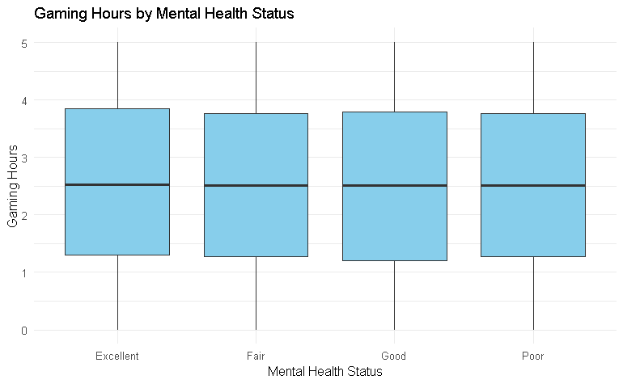
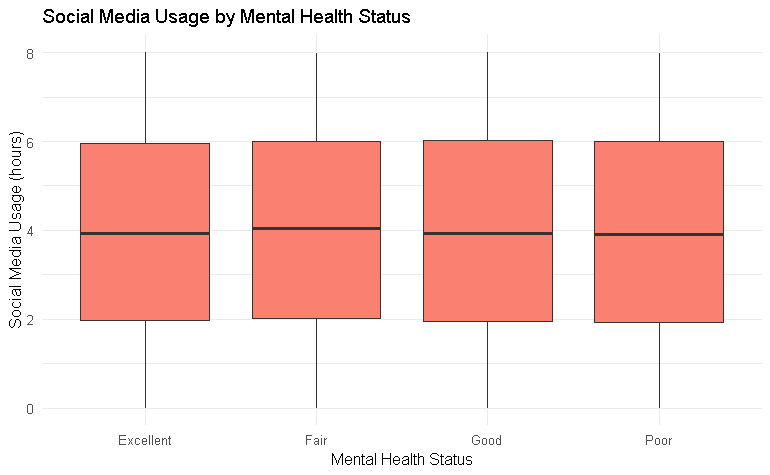
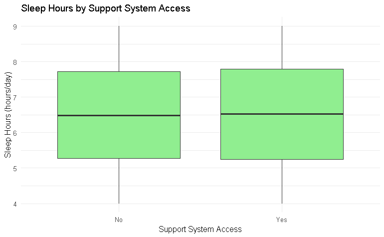

# Technology & Mental Health: Statistical Analysis

**Atharva Bhushan Karekar** | Syracuse University | Spring 2025

*Statistical analysis of technology usage patterns and their impact on mental & physical well-being*

---

## 🎯 Project Overview

Analyzed the relationship between digital behavior (social media, gaming, screen time) and health outcomes (mental health, stress, sleep, physical activity) using multiple statistical methods on 10,000 individuals.

---

## 📊 Key Findings

### Finding #1: Gaming & Social Media ≠ Poor Mental Health ❌

<table>
<tr>
<td width="50%">

</td>
<td width="50%">

</td>
</tr>
</table>

**Statistical Evidence:**
- **ANOVA**: p > 0.48 (not significant)
- **Bayes Factor**: BF ≈ 0.0003 (strong evidence for no effect)
- **Multinomial Regression**: All p > 0.24

**Result:** No relationship found between gaming/social media usage and mental health status.

---

### Finding #2: Screen Time ≠ Stress Level ❌

**Statistical Evidence:**
- **ANOVA**: p = 0.20
- **Bayes Factor**: BF = 0.0059 (~170x more likely under null)
- **Ordinal Regression**: β ≈ 0, p = 0.33

**Result:** Screen time does not predict stress levels.

---

### Finding #3: Technology Usage ≠ Sleep Duration ❌

**Statistical Evidence:**
- **ANOVA**: p >> 0.05
- **Bayes Factor**: BF ≈ 2.9e-08 (overwhelming support for null)
- **Linear Regression**: β = -0.0045, R² = 0.0001

**Result:** No significant relationship between technology use and sleep patterns.

---

### Finding #4: Social Media ≠ Reduced Physical Activity ❌

**Statistical Evidence:**
- **Bayes Factor**: BF = 0.024 (~42x more likely under null)
- **Linear Regression**: β = 0.0029, p = 0.816, R² ≈ 0

**Result:** Social media usage does not reduce physical activity.

---

### Finding #5: Support Systems = MORE Physical Activity ✅

<table>
<tr>
<td width="50%">

**Sleep:** No difference (p = 0.33)

</td>
<td width="50%">

**Physical Activity:** Significant! (p = 0.027) ✅

</td>
</tr>
</table>

**Statistical Evidence:**

| Outcome | Test | Result |
|---------|------|--------|
| **Physical Activity** | T-test | **p = 0.027** ✅ |
| | Linear Regression | **β = 0.13, p = 0.027** ✅ |
| | Effect | +0.13 hrs/day |
| **Sleep** | T-test | p = 0.33 ❌ |
| | Linear Regression | β = 0.028, p = 0.33 ❌ |

**Result:** Support systems significantly increase physical activity but don't affect sleep.

---

## 📈 Statistical Methods Summary

| Analysis | Models Used | Best Performing |
|----------|-------------|-----------------|
| Mental Health vs Tech | ANOVA (Frequentist & Bayesian), Multinomial Regression | All showed no effect |
| Stress vs Screen Time | ANOVA (Frequentist & Bayesian), Ordinal Regression | All showed no effect |
| Sleep vs Technology | ANOVA (Frequentist & Bayesian), Linear Regression | All showed no effect |
| Physical Activity vs Social Media | Bayesian Correlation, Linear Regression | No relationship |
| Support Systems Impact | T-tests, Linear Regression | Significant for physical activity only |

---

## 💡 Main Takeaway

> **Human connection matters more than limiting technology.**
> 
> Contrary to popular belief, we found NO significant relationship between technology usage and poor health outcomes. However, access to support systems showed a measurable positive impact on physical activity.

---

## 🛠️ Technical Skills Demonstrated

- **Statistical Testing**: ANOVA (Frequentist & Bayesian), T-tests, Linear Regression, Multinomial/Ordinal Regression
- **Data Analysis**: R Programming, Data Cleaning, Feature Engineering
- **Visualization**: ggplot2, Statistical Graphics
- **Sample Size**: 10,000 observations
- **Variables Analyzed**: 40+ features from 270+ original attributes

---

## 📊 Complete Results Table

| Research Question | Statistical Test | Test Statistic | P-Value | Conclusion |
|-------------------|------------------|----------------|---------|------------|
| Gaming → Mental Health | ANOVA | - | > 0.48 | No effect |
| Gaming → Mental Health | Bayes Factor | BF = 0.00022 | - | Strong null support |
| Social Media → Mental Health | ANOVA | - | > 0.48 | No effect |
| Social Media → Mental Health | Bayes Factor | BF = 0.00034 | - | Strong null support |
| Screen Time → Stress | ANOVA | - | 0.20 | No effect |
| Screen Time → Stress | Bayes Factor | BF = 0.0059 | - | Strong null support |
| Technology → Sleep | ANOVA | - | >> 0.05 | No effect |
| Technology → Sleep | Linear Reg | R² = 0.0001 | >> 0.05 | No predictive power |
| Social Media → Physical Activity | Correlation | - | 0.816 | No relationship |
| Social Media → Physical Activity | Bayes Factor | BF = 0.024 | - | Strong null support |
| **Support → Physical Activity** | **T-test** | **t = 2.21** | **0.027** | **Significant ✅** |
| **Support → Physical Activity** | **Linear Reg** | **β = 0.13** | **0.027** | **Significant ✅** |
| Support → Sleep | T-test | t = 0.97 | 0.33 | No effect |

---

## 📚 Dataset

**Source:** [Kaggle - Mental Health and Technology Usage Dataset](https://www.kaggle.com/datasets/waqi786/mental-health-and-technology-usage-dataset)  
**Size:** 10,000 individuals  
**Variables:** Social media usage, gaming hours, screen time, sleep, physical activity, stress, mental health status, support systems

---

## 👨‍💻 Author

**Atharva Bhushan Karekar**  
Master's in Applied Data Science | Syracuse University  
Course: ITS 686 - Information & Technology Management  
Spring 2025

---

**Technologies Used**

